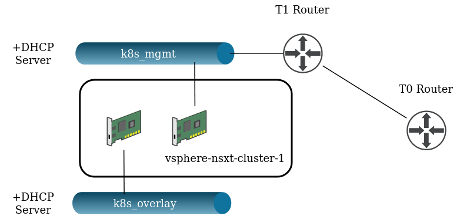

# NSX-T POC Terraform Script

## About

This script is intended to proof of concept/test the NSX-T container networking interface for Kubernetes. It does so by spinning up a single node, K8s Cluster from Rancher and applying the NSX-T manifest.

---

## Requirements

NSX-T needs to be configured in an existing vSphere environment, including:

* T0 Router
* Transport Zones for North-West and East-West traffic
* Edge cluster

---

## What this script does

At a high level, the sript provisions the following:

* Test

